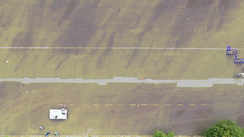

Multiple objects detection and tracking from bird view stationary drone videos
=========

This project is used to extract trajectories as precise as possible for different entities in a mixed traffic scene, from drone videos taken while hovering in the same position (stationary).

The project needs a pretrained network for detection, which should be trained separately. The network included with this library is Yolov4 in a pytorch format. The loading and running of Yolo model is done with the help of scripts taken from [this project](https://github.com/Tianxiaomo/pytorch-YOLOv4) (All of them are in *offlinemot/tool* subfolder)

Example output for a sample video, taken from [**Vehicle-Crowd Interaction  (VCI) - CITR Dataset**](https://github.com/dongfang-steven-yang/vci-dataset-citr) :




***This example shows some minor problems because the scene, the background and the drone's camera are outside the detection network training set (never seen before by the detection network).***

***However, the application of this project (including the Yolo network training) was targeted for a Cyclists dataset videos [to be cited later], where all the trajectories where extracted successfully.***


## Features of this work:

Drone videos are subject to some random movements due to a few factors like noise in the control or wind. For that a fixing step for all the affected frames is needed. 

Additionally running the detection for every frame is slow and can be substituted by the usage of a background subtracting method to detect all moving objects. If the video are stationary (like the assumption here) then the background is the same for the whole video.

At the end and because the work is offline, additional filtering steps can be done to find: 

- The true size of each object (which should be the same because it is taken from bird's eye view)
- The orientation of all the objects in each frame
- Solving the errors of misclassifying some objects by assigning the highest and most probable detected class to them. 
- Smoothing the trajectories.

All this is feasible because of the specific features of the problem, namely (bird's eye view, offline and 
stationary camera)

## Getting Started

After cloning this project, and changing the detection model (in case you need to detect other objects than cyclists, pedestrians and cars), the requirements packages should be installed, so simply, cd to the root of this project and run:

```
pip install -r requirements.txt
```

### Parameters Tunning

There are many parameters that should be tuned before running the tracking on a new video. All of them are in the `offline_mot/config.py` file. 

A detailed explanation for all of them is available on the same file above as well as in the docs folder, namely [Working example](./docs/A_Working_Example.ipynb)

It is recommended to make a few tests with these parameters, in order to find the most suitable set for the requested video.

### Running

Then to run it on some video, the command is:

```
python offline_mot\main.py -v [directory of the videos, ex: docs\sample.mp4]
```
to show the result on the same video after post processing, just replace `main.py` by `show_results.py` in the previous command. i.e:

```
python offline_mot\show_results.py -v [directory of the videos, ex: docs\sample.mp4]
```

### Usage cases

This project can be used for:

* Traffic trajectories extraction from videos (It was applied successfully to extract trajectories from the cyclists datasets for traffic modelling research recorded in TU-Clausthal).

* Tracking other objects (like animals) from bird's eye view in an offline manner.


## Workflow

Three methods are applied for the detection and tracking in this project. They are ,in the order of their priority:

* Background Subtraction: This method are used on every frame to detect the foreground objects which contain any moving object. If these objects are already tracked then nothing happen. Otherwise, it would be added and tracked as candidate objects (white boxes)

* Tracking with a filter like KCF (Kernelized Correlation Filter), which only needs the first bounding box of the object to track. These objects will continue to be tracked as long as the tracker keep giving results successfully. Otherwise, the object will not be updated to a new position and a detection step is performed

* Detection with a network model like Yolo: This is performed only for every *N* frame as set in the `config.py` file. If the object is already tracked then it is confirmed and set to a class type, otherwise nothing happen (only a message saying that something is detected but wasn't there previously)

All these three steps are done for every object and the result is recorded for every frame. If one object keep failing all the steps then it will be deleted after a defined number of times.

## Examples and Documentation

There are a few jupyter notebook showcases for the different tracking and detection handling programs, and an additional working example for how to run and set the different parameters, Namely:

1. Background subtraction  example [here](./docs/Background_Subtraction_Example.ipynb)

2. Tracking example [here](./docs/Tracking_Example.ipynb)

3. Fixing the view example [here](./docs/Fixing_the_view.ipynb)

4. A general working example [here](./docs/A_Working_Example.ipynb)

It is recommend to go through them if a deeper understanding of the steps is needed.

--------------------

## Testing

There are a number of test units for this project. To run the tests use the command:
```
$ python -m pytest tests
```

For the previous command  `pytest` library is needed to be installed.

--------------------

## Support

If you have any questions or comments, or if you find any bugs, please open an issue in this project. Please feel free
to fork the project, and create a pull request, if you have any improvements or bug fixes. 
Additionally, the [contribution instructions](CONTRIBUTING.md) has further details.


--------------------
## Citation Info
To be added

## Stars

Please star this repository if you find it useful, or use it as part of your research.

## License

[MIT License](https://choosealicense.com/licenses/mit/)