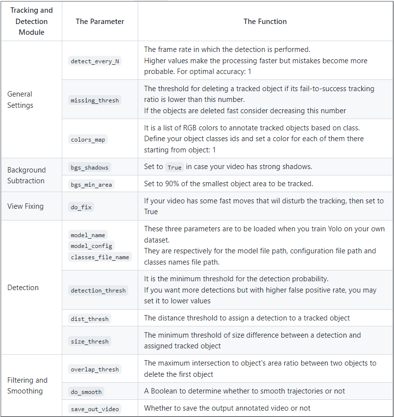

# Summary

The topic of multi objects tracking (MOT) is still considered an open research area [@MOTChallenge20].
Among the many available methods for this problem, it is worth mentioning *Deep Sort* [@wojke2017simple], where a detection and tracking steps are done in real time and for different types of scenes and areas (for example for pedestrians movement or for vehicles tracking). Another state-of-the-art method is *Tracktor* [@bergmann2019tracking], where tracking is done by repetitive detections on all the frames in the video. 

The importance of the problem comes from its many applications, for example self-driving cars software, traffic analysis, or general surveillance applications.  
Unfortunately, due to the variety of scenes and contexts and due to the time constrains that are needed for some applications, there is no one general solution capable of working perfectly for all cases. 

For example, between the two cases of a moving camera recording side view road traffic, and a drone camera recording from above, there are many different challanges that should be addressed for each case. Developing one method for both cases, will make this method less effective for addressing each case problems alone. 

 `OfflineMOT`, the package introduced here, tries to provide a solution to a more restricted problem, namely bird’s eye stationary videos without real-time condition. It applies mainly three techniques for detection and tracking on three different priority levels. Below they are listed from lowest to highest.

- The first level is **background subtraction**. It is a fast method to find what pixels have changed in the image (the forground), and this is possible because of the stationary condition. Otherwise, if the drone's camera is moving freely, then the background will be less learnable. 
Another problem here is the subtle movement of the drone due to wind and control noise. To solve this, a program for fixing the view is implemented. It is based on matching the background features with every next frame, and then transforming the frame if a big movement is detected.

- The second level is **multi-objects tracking** methods such as *kernelized correlation filters* (KCF) [@henriques2014high]. This method takes the output of the detection and the next frame and it gives the next postions of the objects. It can also return the failure or success states of tracking.

- The third level is the **deep learning-based detection and classification** of the objects. Here, *Yolo-v4* [@yolov4] is used as a model structure where training is done separately. The used code to implement, load and train Yolo structure is taken from [@Tianxiaomo] 

Finally, all these parts are implemented separately in the code, making it easy to enable and disable any parts of them, with many tunable parameters. This is done on purpose to facilitate the processing on any new video with different settings by changing only a few parameters.

The following pesudo code \autoref{fig:workflow} illustrates the main workflow implemented in this project.


# Statement of need

The specific case for extracting trajectories from top view, stationary traffic videos (for pedestrians, cyclists and vehicles) lacks targeted open source solutions in the literature. 
Therefore, the development of this package is directed towards helping researchers in the field of traffic analysis or any other fields where trajectories of moving objects are needed.  

With the help of this package, the extraction of trajectories from a cyclists’ behavior dataset in TU Clausthal will be done. The package has proved its ability of producing very accurate results for different scenes and conditions in these videos. The dataset itself will be published later.

# Parameters Tuning Procedure

In order to run the program on a new video, optimally all the parameters should be tuned for all the tracking and detection modules, starting from the basic operations of general settings and background subtraction and ending with detection and post processing operations.

All these parameters are made available in one file. It can be edited by running the following function after installing:

```python
offlinemot.main.set_params()
```

In the following table, the most important ones of these parameters are listed along with how to tune them for a new video. 


<!-->
<html>
</br>
</br>
</br>
    <table align="center" border="1">
        <caption> Table 1: Important parameters to tune in <code>config.py</code></caption>
        <thead>
            <tr>
                <th>Tracking and </br>Detection</br> Module</th>
                <th>The Parameter</th>
                <th>The Function</th>
            </tr>
        </thead>
        <tbody>
            <tr>
                <td rowspan=3>General Settings</td>
                <td> <code> detect_every_N </code> </td>
                <td> The frame rate in which the detection is performed. </br> 
                    Higher values make the processing faster but mistakes become more probable. For optimal accuracy: 1</td>
            </tr>
            <tr>
                <td> <code>missing_thresh</code></td>
                <td> The threshold for deleting a tracked object if its fail-to-success tracking ratio is lower than this number. </br>
                If the objects are deleted fast consider decreasing this number</td>
            </tr>
            <tr>
                <td> <code>colors_map</code> </td>
                <td>It is a list of RGB colors to annotate tracked objects based on class. </br>
                Define your object classes ids and set a color for each of them there starting from object: 1</td>
            </tr>
            <tr>
                <td rowspan=2>Background </br> Subtraction</td>
                <td> <code>bgs_shadows</code></td>
                <td> Set to <code>True</code> in case your video has strong shadows.</td>
            </tr>
            <tr>
                <td> <code>bgs_min_area</code> </td>
                <td> Set to 90% of the smallest object area to be tracked.</td>
            </tr>
            <tr>
                <td rowspan=1>View Fixing</td>
                <td> <code>do_fix</code> </td>
                <td> If your video has some fast moves that wil disturb the tracking, then set to True</td>
            </tr>
            <tr>
                <td rowspan=4>Detection </td>
                <td>
                        <code>model_name</code>  </br>    
                        <code>model_config</code>     </br>
                       <code>classes_file_name</code> 
                </td>
                <td>These three parameters are to be loaded when you train Yolo on your own dataset.
                </br>
                They are respectively for the model file path, configuration file path and classes names file path. 
                </td>
            </tr>
            <tr>
                <td> <code>detection_thresh</code> </td>
                <td> It is the minimum threshold for the detection probability. 
                </br>
                If you want more detections but with higher false positive rate, you may set it to lower values 
                </td>
            </tr>            
            <tr>
                <td> <code>dist_thresh</code> </td>
                <td> The distance threshold to assign a detection to a tracked object</td>
            </tr>            
            <tr>
                <td> <code>size_thresh</code> </td>
                <td> The minimum threshold of size difference between a detection and assigned tracked object</td>
            </tr>
            <tr>
                <td rowspan=3>Filtering and </br> Smoothing</td>
                <td> <code>overlap_thresh</code> </td>
                <td> The maximum intersection to object's area ratio between two objects to delete the first object </td>
            </tr>
            <tr>
                <td> <code>do_smooth</code> </td>
                <td>A Boolean to determine whether to smooth trajectories or not</td>
            </tr>
            <tr>
                <td> <code>save_out_video</code> </td>
                <td> Whether to save the output annotated video or not</td>
            </tr>
        </tbody>
    </table>

</html>

<-->

# Scope

The scope of the problems that can be handled by this package is defined by the following conditions:

1.	*The video is stationary*
2.	*The real time performance is not a priority*
3.	*The view direction of the video is from bird’s eye view*
4.	*A pretrained detection model for the objects of interest is avaliable*

Regarding the last point, the model provided with the package is trained on random images of cyclists, cars and pedestrians from bird’s eye view. This can be enough if the problem is the same, i.e. tracking traffic entities. Otherwise, this model could be a good starting point to train for other kinds of objects if these objects are similar and Yolo v4 is used as a model structure.

## Failure Cases

If the video is too noisy, has low resoluation, or the training dataset detection is very different from the video background and objects, then errors in tracking can happen.

As an example, the sample video has some problems with one moving object, because of the different background and the new scene of the video. This can be avoided by retraining the detection part (Yolo network) on similar examples. Additionally, a thorough tunning step for the parameters in the `config` file should be done to eliminate possible errors in the result. 

### Acknowledgment
This work was supported by the German Academic Exchange Service (DAAD) under the Graduate School Scholarship Programme (GSSP).The training of Yolo network and labeling the datasets was done by Merlin Korth and Sakif Hossain.

# References